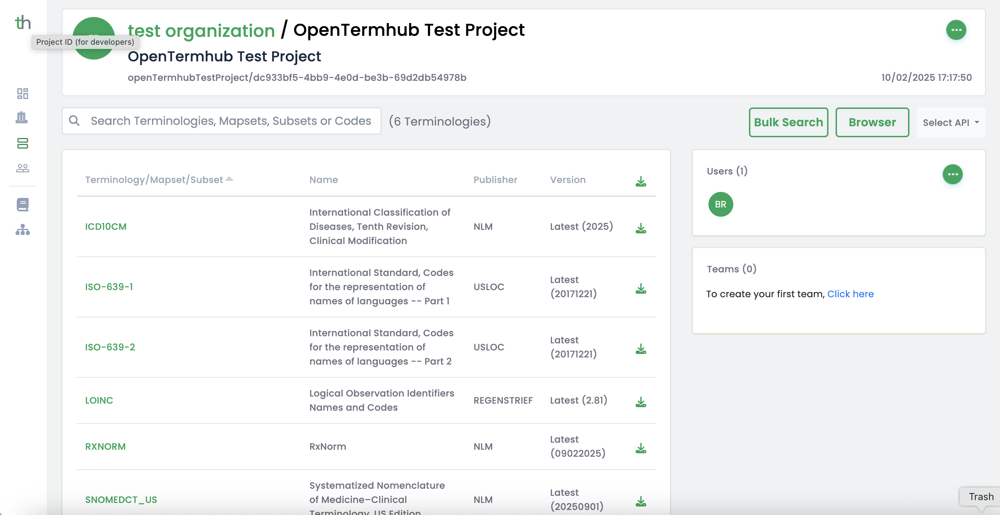

# Deploying Open TermHub with Full Terminologies from TermHub

This documentation describes considerations and steps for creating a TermHub project,
configuring a number of terminologies such as SNOMEDCT_US, RXNORM, ICD10CM, and LOINC
and deploying them to a running container.

This includes considerations about using syndication (or not) as well as memory usage
and disk space requirements for a variety of situations.  Also included is a discussion
of the use of the additional features such as enabling post load calculations and use of
the embedded terminology browser.

## Configuration Options

### Environment Variables

The following environment variables can be used to configure the application:

- `DEBUG`: set to "true" to see debug messages in the log
- `JAVA_OPTS`: Java options including memory usage, recommendation is to use `-Xmx4g` (we are testing various scenarios to allow this to be done with `-Xmx2g`).  NOTE: if you load data separately from deployment, you only need the setting this high while loading data, then can deploy with `-Xmx1g`.
- `ENABLE_POST_LOAD_COMPUTATIONS`: Enable/disable post-load computations (default: false).  This can be set to "true" to compute tree position information which is used by the embedded browser to display hierarchy information.
`PROJECT_API_KEY`: Authentication token for secure operations (required only if using Terminology Syndication from www.terminologyhub.com). To obtain this token, [see below](#creating-a-termhub-project-with-an-api-key):
- `SYNDICATION_CHECK_ON_STARTUP` (optional): when set to `true`, performs a one-time syndication load at application startup. If not set or false, no startup syndication occurs.
- `SYNDICATION_CHECK_CRON` (optional): a Spring cron expression (6 fields: sec min hour dom mon dow) to enable periodic re-syndication. If not set or empty, no schedule is registered. Requires `PROJECT_API_KEY`.

**[Back to top](#deploying-open-termhub-with-full-terminologies-from-termhub)**

### application.properties examples

```bashs
# Enable syndication
syndication.token=<your-project-api-key>

# Optional: one-time startup load
syndication.check.on-startup=true

# Optional: periodic re-syndication (Spring cron format: sec min hour dom mon dow)
syndication.check.cron=0 0 0 * * *
```

### Docker examples

One-time startup load only:

```bashs
docker run --rm --name open-termhub -p 8080:8080 \
  -e PROJECT_API_KEY=... \
  -e SYNDICATION_CHECK_ON_STARTUP=true \
  wcinformatics/open-termhub:latest
```

Periodic re-syndication only:

```bashs
docker run --rm --name open-termhub -p 8080:8080 \
  -e PROJECT_API_KEY=... \
  -e SYNDICATION_CHECK_CRON="0 0 0 * * *" \
  wcinformatics/open-termhub:latest
```

Both startup and periodic:

```bashs
docker run --rm --name open-termhub -p 8080:8080 \
  -e PROJECT_API_KEY=... \
  -e SYNDICATION_CHECK_ON_STARTUP=true \
  -e SYNDICATION_CHECK_CRON="0 0 0 * * *" \
  wcinformatics/open-termhub:latest
```

## Data Persistence

The application uses Lucene for fast searching of terminology data. By default, indexes are stored in `/index`. To persist these indexes between container restarts, mount a volume to `/index` on the container.  For example,

```bashs
docker run --rm --name open-termhub -p 8080:8080 \
  -v /path/to/index/folder:/index \
  wcinformatics/open-termhub:latest
```

### Volume size

The exact size needed for the volume varies and depends on the number and size of terminology assets included in the deployment.  For example, a configuration that loads the latest versions of SNOMEDCT_US, RXNORM, LOINC, and ICD10CM with `ENABLE_POST_LOAD_COMPUTATIONS=true` a volume size of 20GB is recommended.  The same data set up with `ENABLE_POST_LOAD_COMPUTATIONS=false` requires a small volume size of 10GB.

The best strategy is to load the data assets you need in an "offline" environment and you can see exactly how much space is needed, then provision a volume for the container that is large enough for that size.

**[Back to top](#deploying-open-termhub-with-full-terminologies-from-termhub)**


## Creating a TermHub Project with an API Key

The primary content provider for Open TermHub is the TermHub (cloud) application itself.  The idea is that you can use TermHub to configure "projects" that have terminology specifications that you want to use.

The basic steps are
* Log into your TermHub account
* Go to the "Projects" page from the left sidebar
* Click "New Project"
* Configure your projet
  * Choose an organization (this should be the "paid" organization for your plan for long term use)
  * Enter a project name and description (e.g. "Open TermHub Test Project")
  * Choose your terminologies (e.g. SNOMEDCT_US, ICD10CM, LOINC, RXNORM - all "latest" versions)
  * Save the project configuration
* Setup a project API Key
  * Edit your project using the three-dots icon near the upper right on your project details page.
  * Find "Project API Key" and create a new one and then copy it
  * This is the PROJECT_API_KEY environment variable value you will use for syndication (if desired)

### For Example

Here is an example of a project with a number of "latest" terminology versions



**[Back to top](#deploying-open-termhub-with-full-terminologies-from-termhub)**


## Loading the Container

There are a few options for loading a container including:
* Pre-loading a volume offline and then mounting it to a container (**RECOMMENDED**)
* Using syndication to have a container load itself upon startup
* Launching a container and loading it from "downloaded" artifacts


### Pre-loading a Volume

This option is recommended for situations where you want to control terminology versions and ensure the data being served by the container is exactly what is needed by downstream services.  This is also a recommended option for running with Kubernetes because it will allow you to scale pods in "read only" mode that are mounted with the same persistent volume.

This option is NOT recommended if you want to use "latest" versions and have the container automatically "update" content. This option is NOT recommended if you need to make write calls to the container and intend to have multiple pods running.

There are two approaches to pre-loading a volume:

#### Option 1: Using the Standalone Syndication Loader (Recommended)

The standalone syndication loader (`syndicate.sh`) is a dedicated script that loads data and exits, making it ideal for pre-loading scenarios. This approach provides better control and error handling compared to startup syndication.

**Step 1: Prepare the index directory**

```bash
export INDEX_DIR=/path/to/index/folder
/bin/rm -rf $INDEX_DIR/*
mkdir -p $INDEX_DIR
chmod -R a+rwx $INDEX_DIR
```

**Step 2: Run the syndication loader**

```bash
docker run --rm \
  -e PROJECT_API_KEY=your-api-key-here \
  -e JAVA_OPTS=-Xmx4g \
  -e SYNDICATION_CHECK_ON_STARTUP=false \
  -v "$INDEX_DIR":/index \
  wcinformatics/open-termhub:latest \
  /srv/rt/syndicate.sh
```

The loader will:
- Download and load all content from your TermHub project
- Exit with code 0 on success, non-zero on failure
- Always stop (never run indefinitely)

Note: Adjust `JAVA_OPTS` as needed based on the size of your data and docker has memory limitations as well that may need to be configured on the host system.

**Step 3: Verify the results**

Check the exit code:
```bash
echo $?
```

If the exit code is 0, data was loaded successfully.

**Step 4: Deploy the server**

Now deploy the server without syndication:

```bash
docker run -d --rm --name open-termhub \
  -e JAVA_OPTS=-Xmx1g \
  -e ENABLE_POST_LOAD_COMPUTATIONS=false \
  -v "$INDEX_DIR":/index \
  -p 8080:8080 \
  wcinformatics/open-termhub:latest
```

Note: Since data is pre-loaded, you can use less memory (`-Xmx1g`) and don't need `PROJECT_API_KEY` or `SYNDICATION_CHECK_ON_STARTUP`.

**Error Handling**

The standalone loader will:
- Exit code 0: Success
- Exit code 1: Syndication errors
- Exit code 2: Configuration errors (e.g., missing `PROJECT_API_KEY`)

Enable debug logging with `-e DEBUG=true` for troubleshooting.

For a complete tutorial on pre-loading, see [TUTORIAL_PRELOAD.md](TUTORIAL_PRELOAD.md).

#### Option 2: Using Startup Syndication

Alternatively, you can use the server's startup syndication feature to pre-load data:

```bash
docker run --rm \
  -e PROJECT_API_KEY=your-api-key-here \
  -e SYNDICATION_CHECK_ON_STARTUP=true \
  -e JAVA_OPTS=-Xmx4g \
  -v "$INDEX_DIR":/index \
  wcinformatics/open-termhub:latest
```

After data loads, stop the container and redeploy without syndication settings.

**Note**: The standalone loader (Option 1) is preferred because it provides better error handling and clearer separation between data loading and server operation.


### Loading Data with Syndication

Open TermHub supports syndication of content from a TermHub project that is configured with an API key and one or more terminology/subset/mapset (code system, value set, concept map) resources.  [See the section above](#creating-a-termhub-project-with-an-api-key) for information on setting up a project.

Syndication features are enabled when a token is provided. Use one or both of the modes below:

- One-time startup load: set `PROJECT_API_KEY` and `SYNDICATION_CHECK_ON_STARTUP=true`. If not set, the app starts and performs no syndication at startup.
- Periodic re-syndication: set `PROJECT_API_KEY` and `SYNDICATION_CHECK_CRON` to a valid Spring cron expression.

Examples of valid Spring cron expressions:

```
0 0 0 * * *
0 5 * * * *
```

#### Spring cron vs UNIX cron

- Spring cron uses 6 fields: seconds minutes hours day-of-month month day-of-week (optional 7th year). UNIX cron uses 5 fields (no seconds).
- If you paste a 5‑field UNIX cron into `syndication.check.cron`, it will fail to parse. Add a leading seconds field.

Common conversions:

```bashs
# UNIX → Spring
# Daily at midnight
0 0 * * *      ->  0 0 0 * * *

# Every 5 minutes
*/5 * * * *     ->  0 */5 * * * *

# Hourly at minute 5
5 * * * *       ->  0 5 * * * *
```


#### Resyndication

If the TermHub project has been configured with "latest" versions of terminologies, you can configure periodic re-syndication via `SYNDICATION_CHECK_CRON`. The service will reconcile the project feed with the currently loaded data and load new versions when available.

- Example: `SYNDICATION_CHECK_CRON="0 0 0 * * *"` for daily at midnight
- Warning: avoid running multiple containers mounted to the same indexes volume with the same Spring cron schedule (concurrent writes will conflict)

#### Startup one-time load

To perform a one-time load at startup, set `SYNDICATION_CHECK_ON_STARTUP=true`. If not set or false, the application starts and performs no syndication on startup.


### Loading Data Manually

Open TermHub also supports loading files downloaded from TermHub.  The project details page has download icons for each of the terminology resources (as well as a "download all" option at the top of the table).  To use this approach you will want to pick "Format: FHIR R5 json" in the dialog that pops up when you download.

The basic steps for this are:
* Log into TermHub and navigate to your project
* Use "download all" and choose "Format: FHIR R5 json" -> this downloads a series of .zip files
* Unpack each of the zip files to reveal a FHIR .json file that can be directly loaded with commands
like those in the (TUTORIAL1.md)[TUTORIAL1.md].  For example,

```
curl -X POST 'http://localhost:8080/fhir/CodeSystem/$load' \
-H "Content-Type: multipart/form-data" \
-F "resource=@CodeSystem-snomedct_us-nlm-20250901-r5.json"
```

These represent single individual versions of the terminology files and can be loaded as needed (and deleted as needed).

This approach is recommended if you do not want to rely on the embedded capabilities of the syndication mechanism and prefer to build a means to download and precisely loads of specific versions of data that you later intend to deploy to a running container.

**[Back to top](#deploying-open-termhub-with-full-terminologies-from-termhub)**


## Troubleshooting

The following are issues you may encounter and information on how to resolve them.

**Encountering "out of memory" errors**

In this situation, use the `JAVA_OPTS` environment variable to set the available memory higher (e.g. `JAVA_OPTS=-Xmx8g`.  In practice, we have found that 4g is sufficient even for large files.


**[Back to top](#deploying-open-termhub-with-full-terminologies-from-termhub)**


