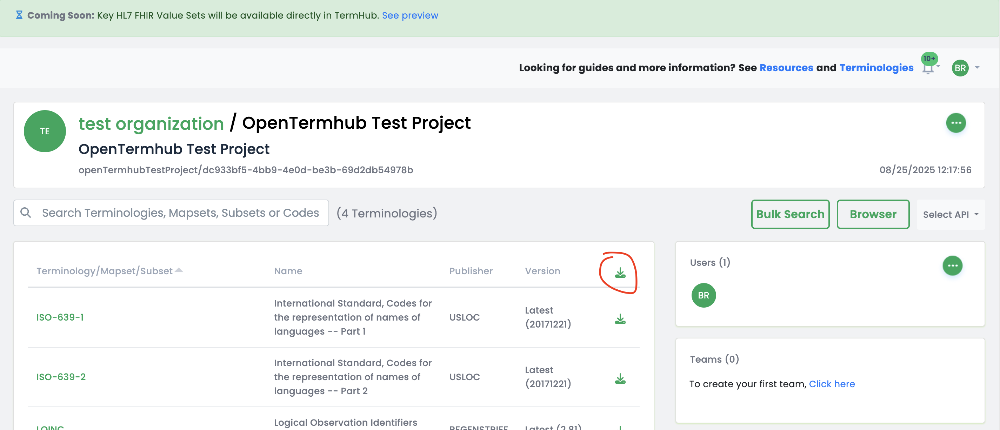
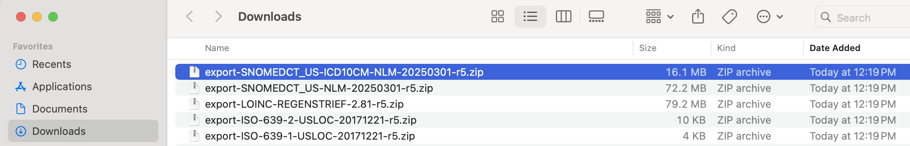

# Step-by-step instructions to Deploy Terminologies with TermHub

Instructions on using data from a TermHub project to Open Termhub up and running within 5 minutes.

[Tutorial Training Video (TBD)](TBD)

## Prerequisites/Setup
* Docker installed

## Create TermHub account/login

### Creating an account (skip if you have one)

Start by going to the [Termhub Signup Page](https://app.terminologyhub.com/signup).  You can sign up with a username/password or via social login using a Google or Microsoft account.  Your email address will be your username.

### Logging in (once you have created an account)

Go to the [Termhub Login Page](https://app.terminologyhub.com/login) and log in using the account created in the previous step.

**[Back to top](#step-by-step-instructions-to-deploy-terminologies-with-termhub)**

## Creating a TermHub Project

To properly test this, you'll want to create a TermHub project with the terminologies that you want to load into the Open TermHub container.

### Steps after logging into TermHub

* **Click the "Projects" sidebar item**


* **Click the "New Project" button**


* **Select your organization**
* **Set "Project Name" to "OpenTermhub Test Project"**
* **Set "Project Description" to "OpenTermhub Test Project"**


* **Scroll down to choose terminologies to add**
  * **SNOMEDCT_US latest (also select the ICD10CM maps and the extension subset)**
  

  
  * **LOINC latest**


  * **ISO-639-1 latest**
  * **ISO-639-2 latest**
  

  
* **Scroll to the bottom and click "Create project"**


* **On the project details screen, choose the icon to download all** (choose "Format: FHIR R5 json)



At this point, you will have downloaded .zip files of all the terminologies set up in the project above.



The next step is to unpack all of these .zip files and put the resulting .json files all together in the same directory, so that we can run the commands to load this data into the Open TermHub server that was launched at the top.

**[Back to top](#step-by-step-instructions-to-deploy-terminologies-with-termhub)**


## Deploy the Container with a PROJECT_API_KEY

```
# On Windows use export INDEX_DIR=c:/tmp/opentermhub/index
# On Windows if running within wsl use export INDEX_DIR=/mnt/c/tmp/opentermhub/index
export INDEX_DIR=/tmp/opentermhub/index
/bin/rm -rf $INDEX_DIR/*; mkdir -p $INDEX_DIR; chmod -R a+rwx $INDEX_DIR
docker run -d --rm --name open-termhub \
  -e ENABLE_POST_LOAD_COMPUTATIONS=true -e JAVA_OPTS="-Xmx16g" \
  -v "$INDEX_DIR":/index -p 8080:8080 wcinformatics/open-termhub:latest
```

**[Back to top](#step-by-step-instructions-to-deploy-terminologies-with-termhub)**


## View API Documentation

All three of the above options will yield a running server and you should now you should be able to access the Swagger UI pages:
* Swagger [http://localhost:8080/swagger-ui/index.html](http://localhost:8080/swagger-ui/index.html)
* FHIR R4 Swagger [http://localhost:8080/fhir/r4/swagger-ui/index.html](http://localhost:8080/fhir/r4/swagger-ui/index.html)
* FHIR R5 Swagger [http://localhost:8080/fhir/r5/swagger-ui/index.html](http://localhost:8080/fhir/r5/swagger-ui/index.html)

**[Back to top](#step-by-step-instructions-to-deploy-terminologies-with-termhub)**


## View Loaded Data with Embedded Browser

Once data is loaded, you can visualize it within the embedded terminology browser.

See [http://localhost:8080/index.html](http://localhost:8080/index.html)

This is a locally-available version of the TermHub browser that lets you interact with the
content loaded into the open termhub container. The hierarchy stuff will only work
properly if you use `ENABLE_POST_LOAD_COMPUTATIONS=true` when loading data.

**[Back to top](#step-by-step-instructions-to-deploy-terminologies-with-termhub)**
