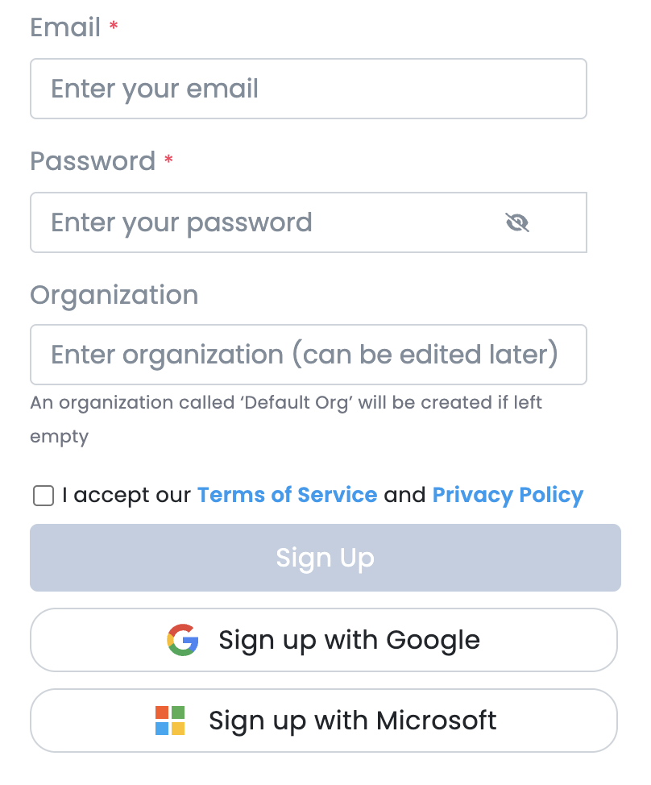
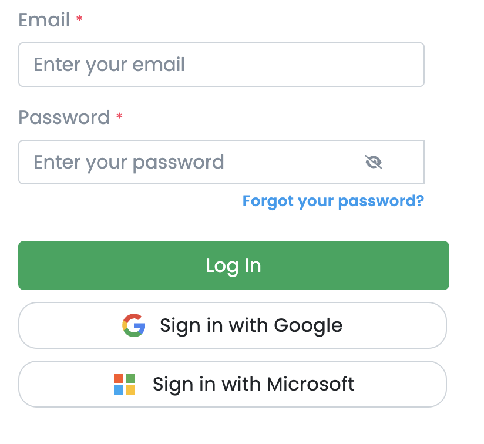
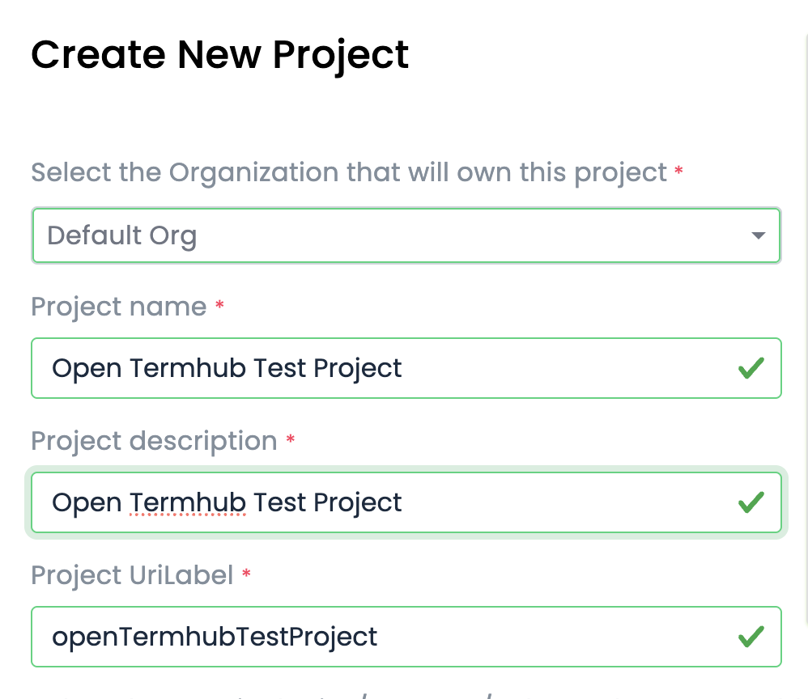
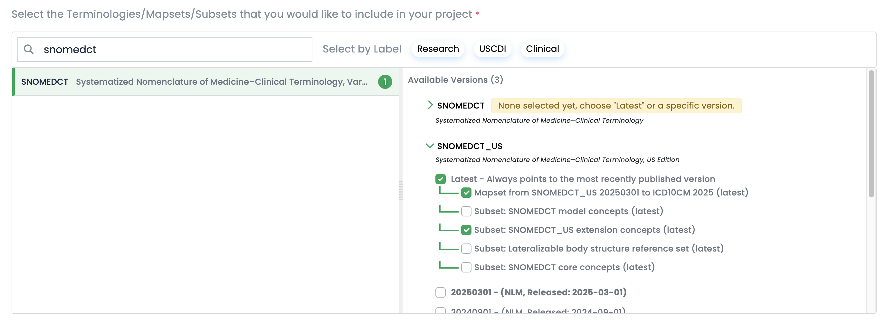
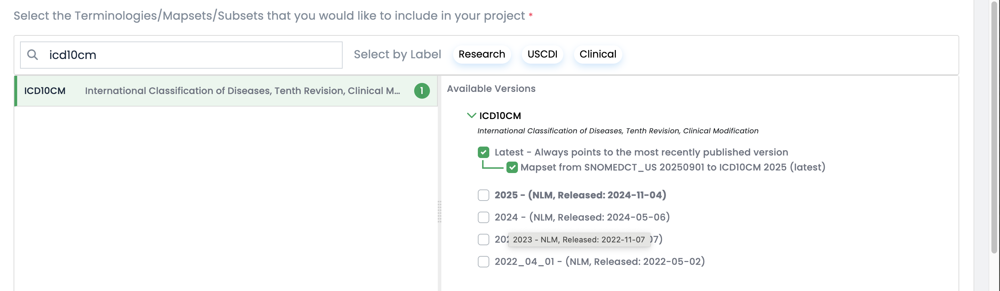
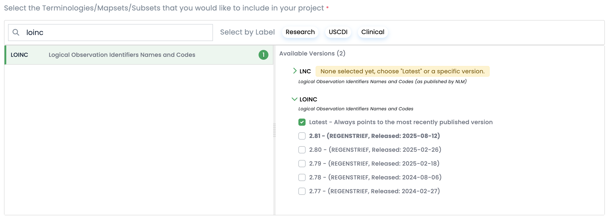
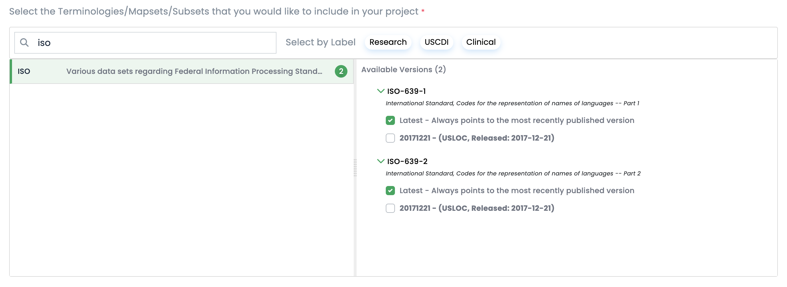
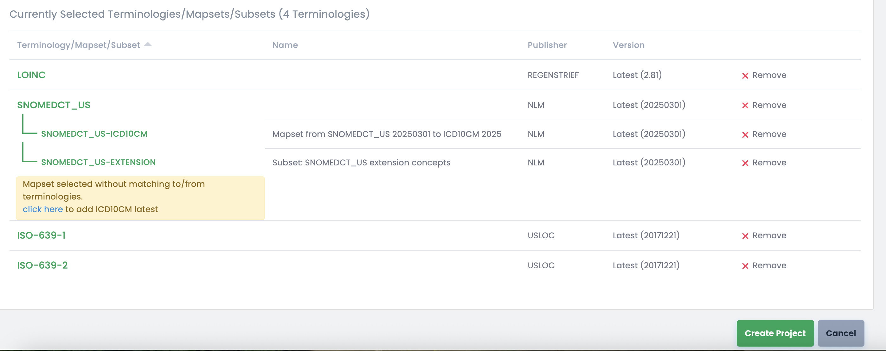
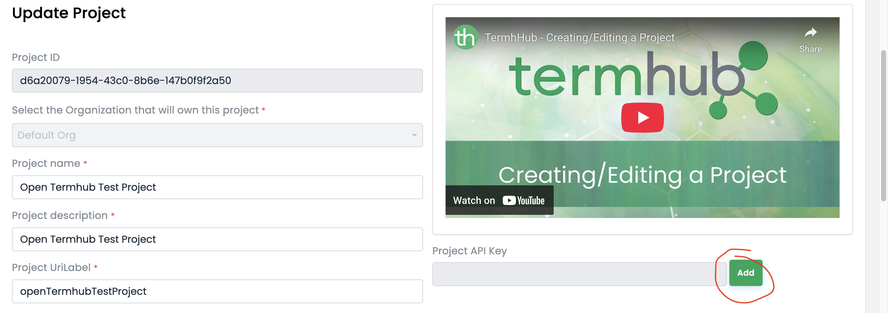
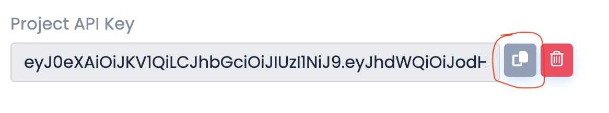

# Step-by-step instructions to Deploy Terminologies with TermHub

Instructions on using data from a TermHub project to Open Termhub up and running within 5 minutes.

[Tutorial Training Video (TBD)](TBD)

## Prerequisites/Setup
* Docker installed

## Create TermHub account/login

### Creating an account (skip if you have one)

Start by going to the [Termhub Signup Page](https://app.terminologyhub.com/signup).  You can sign up with a username/password or via social login using a Google or Microsoft account.  Your email address will be your username.



### Logging in (once you have created an account)

Go to the [Termhub Login Page](https://app.terminologyhub.com/login) and log in using the account created in the previous step.



**[Back to top](#step-by-step-instructions-to-deploy-terminologies-with-termhub)**

## Creating a TermHub Project

To properly test this, you'll want to create a TermHub project with the terminologies that you want to load into the Open TermHub container.

### Steps after logging into TermHub

* **Click the "Projects" sidebar item**


* **Click the "New Project" button**


* **Select your organization** (this may be "Default Org")
* **Set "Project Name" to "Open Termhub Test Project"**
* **Set "Project Description" to "Open Termhub Test Project"**




* **Scroll down to choose terminologies to include**

    * **SNOMEDCT_US latest (also select the ICD10CM maps and the extension subset)**

  
    * **ICD10CM latest**


    * **LOINC latest**


    * **ISO-639-1 latest**, **ISO-639-2 latest**  

  
* **Scroll to the bottom and click "Create project"**




**[Back to top](#step-by-step-instructions-to-deploy-terminologies-with-termhub)**


## Deploy the Container with a PROJECT_API_KEY

Now, you need to assign an api key to your project. In TermHub, go to your project details
page (which is where the project creation flow above leaves off)

* **Click the "Edit project settings" button** (the green three-dot button in upper right)
* **Find "Project API Key" and click "Add"** (the green three-dot button in upper right)



* **Copy the Project API Key" to the clipboard** (the green three-dot button in upper right)



**[Back to top](#step-by-step-instructions-to-deploy-terminologies-with-termhub)**


## Deploy the Container with a PROJECT_API_KEY

With a "Project API Key" in hand, run the docker image using the code shown below. 
* Choose an `INDEX_DIR` that is a volume you have permissions for and can mount to the container.  This volume will get populated with index data as terminology artifacts are loaded.
* Use `PROJECT_API_KEY` obtained from your project, this will allow the container to syndicate your content directly to the server.
* If you want to use the embedded browser to see hierarchies, use `ENABLE_POST_LOAD_COMPUTATIONS=true` instead of `false` as this computes tree position data used by the hierarchy browser. 


### REMOVE THIS BEFORE FINISHING

```
# On Windows use export INDEX_DIR=c:/tmp/opentermhub/index
# On Windows if running within wsl use export INDEX_DIR=/mnt/c/tmp/opentermhub/index
export PROJECT_API_KEY=eyJ0eXAiOiJKV1QiLCJhbGciOiJI...bfUQbjkpX8ivQlpg_30
export INDEX_DIR=/tmp/opentermhub/index
/bin/rm -rf $INDEX_DIR/*; mkdir -p $INDEX_DIR; chmod -R a+rwx $INDEX_DIR
docker run -d --rm --name open-termhub \
  -e JAVA_OPTS=-Xmx4g \
  -e ENABLE_POST_LOAD_COMPUTATIONS=false \
  -e PROJECT_API_KEY=$PROJECT_API_KEY \
  -v "$INDEX_DIR":/index -p 8080:8080 wcinformatics/open-termhub:latest
```

For the configuration described above on a standard Macbook pro, total runtime was about 40 min and the index volume used under 10GB of disk space.  The actual requirements depend on exactly what content you have configured to syndicate into the container.

**[Back to top](#step-by-step-instructions-to-deploy-terminologies-with-termhub)**


## View API Documentation

The prior step yields a running server and you should now you should be able to access the Swagger UI pages:
* Swagger [http://localhost:8080/swagger-ui/index.html](http://localhost:8080/swagger-ui/index.html)
* FHIR R4 Swagger [http://localhost:8080/fhir/r4/swagger-ui/index.html](http://localhost:8080/fhir/r4/swagger-ui/index.html)
* FHIR R5 Swagger [http://localhost:8080/fhir/r5/swagger-ui/index.html](http://localhost:8080/fhir/r5/swagger-ui/index.html)

**[Back to top](#step-by-step-instructions-to-deploy-terminologies-with-termhub)**


## View Loaded Data with Embedded Browser

Additionally, now that data is loaded, you can visualize it within the embedded terminology browser.

See [http://localhost:8080/index.html](http://localhost:8080/index.html)


This is a locally-available version of the TermHub browser that lets you interact with the
content loaded into the open termhub container. The hierarchy stuff will only work
properly if you use `ENABLE_POST_LOAD_COMPUTATIONS=true` when loading data.

**[Back to top](#step-by-step-instructions-to-deploy-terminologies-with-termhub)**
