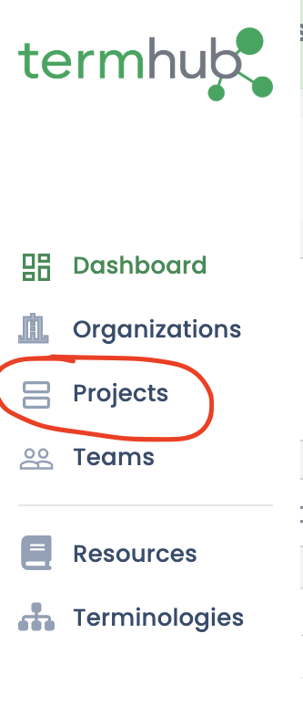
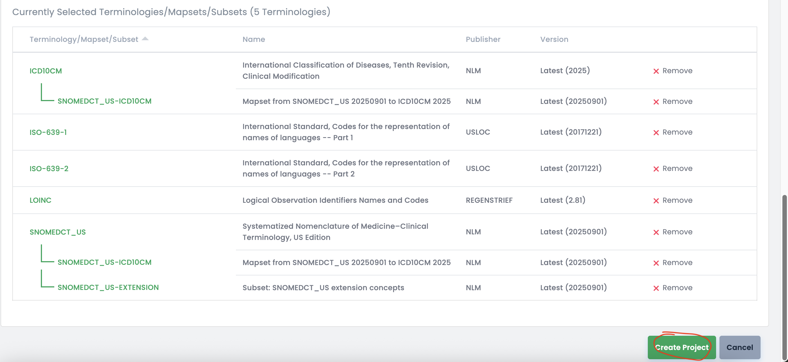

# Step-by-step instructions to Deploy Terminologies with TermHub

Instructions on using data from a TermHub project to Open Termhub up and running within 5 minutes.

[Tutorial Training Video](https://youtu.be/EhEzIK2p1jE)

## Prerequisites/Setup
* Docker installed

## Create TermHub account/login

### Creating an account (skip if you have one)

Start by going to the [Termhub Signup Page](https://app.terminologyhub.com/signup).  You can sign up with a username/password or via social login using a Google or Microsoft account.  Your email address will be your username.


### Logging in (once you have created an account)

Go to the [Termhub Login Page](https://app.terminologyhub.com/login) and log in using the account created in the previous step.


**[Back to top](#step-by-step-instructions-to-deploy-terminologies-with-termhub)**

## Creating a TermHub Project

To properly test this, you'll want to create a TermHub project with the terminologies that you want to load into the Open TermHub container.

### Steps after logging into TermHub

* **Click the "Projects" sidebar item**



* **Click the "New Project" button**


* **Select your organization** (this may be "Default Org")
* **Set "Project Name" to "Open Termhub Test Project"**
* **Set "Project Description" to "Open Termhub Test Project"**


* **Scroll down to choose terminologies to include**

    * **SNOMEDCT_US latest (also select the ICD10CM maps and the extension subset)**

  
    * **ICD10CM latest**


    * **LOINC latest**


    * **ISO-639-1 latest**, **ISO-639-2 latest**  

  
* **Scroll to the bottom and click "Create project"**




**[Back to top](#step-by-step-instructions-to-deploy-terminologies-with-termhub)**


## Deploy the Container with a PROJECT_API_KEY

Now, you need to assign an api key to your project. In TermHub, go to your project details
page (which is where the project creation flow above leaves off)

* **Click the "Edit project settings" button** (the green three-dot button in upper right)
* **Find "Project API Key" and click "Add"** (the green three-dot button in upper right)


* **Copy the Project API Key" to the clipboard** (the green three-dot button in upper right)


**[Back to top](#step-by-step-instructions-to-deploy-terminologies-with-termhub)**


## Deploy the Container with a PROJECT_API_KEY

With a "Project API Key" in hand, you have two options for loading data into the container:

1. **Pre-loading (Recommended for Production)**: Load data first, then start the server
2. **Startup Syndication**: Load data when the server starts

### Option 1: Pre-loading Data (Recommended)

Pre-loading data before starting the server provides better control and allows you to verify data loading succeeded before deployment.

**Step 1: Prepare the Index Directory**

```bash
# On Windows use export INDEX_DIR=c:/tmp/opentermhub/index
# On Windows if running within wsl use export INDEX_DIR=/mnt/c/tmp/opentermhub/index
export PROJECT_API_KEY=eyJ0eXAiOiJKV1QiLCJhbGciOiJI...bfUQbjkpX8ivQlpg_30
export INDEX_DIR=/tmp/opentermhub/index
/bin/rm -rf $INDEX_DIR/*; mkdir -p $INDEX_DIR; chmod -R a+rwx $INDEX_DIR
```

**Step 2: Run the Syndication Loader**

```bash
docker run --rm \
  -e PROJECT_API_KEY=$PROJECT_API_KEY \
  -e JAVA_OPTS=-Xmx4g \
  -v "$INDEX_DIR":/index \
  wcinformatics/open-termhub:latest \
  /srv/rt/syndicate.sh
```

This will download and load all content from your project. The container will exit when complete with:
- **Exit code 0**: Success
- **Exit code 1**: Syndication errors
- **Exit code 2**: Configuration error (missing API key)

**Step 3: Verify Success**

```bash
echo $?  # Should be 0 if successful
```

**Step 4: Start the Server**

Now that data is pre-loaded, start the server without syndication:

```bash
docker run -d --rm --name open-termhub \
  -e JAVA_OPTS=-Xmx4g \
  -e ENABLE_POST_LOAD_COMPUTATIONS=false \
  -v "$INDEX_DIR":/index \
  -p 8080:8080 \
  wcinformatics/open-termhub:latest
```

Note: We **do not** set `PROJECT_API_KEY` or `SYNDICATION_CHECK_ON_STARTUP` because data is already loaded.

### Option 2: Startup Syndication

Alternatively, you can load data when the server starts:

```bash
export PROJECT_API_KEY=eyJ0eXAiOiJKV1QiLCJhbGciOiJI...bfUQbjkpX8ivQlpg_30
export INDEX_DIR=/tmp/opentermhub/index
/bin/rm -rf $INDEX_DIR/*; mkdir -p $INDEX_DIR; chmod -R a+rwx $INDEX_DIR
docker run -d --rm --name open-termhub \
  -e JAVA_OPTS=-Xmx4g \
  -e ENABLE_POST_LOAD_COMPUTATIONS=false \
  -e PROJECT_API_KEY=$PROJECT_API_KEY \
  -e SYNDICATION_CHECK_ON_STARTUP=true \
  -v "$INDEX_DIR":/index \
  -p 8080:8080 \
  wcinformatics/open-termhub:latest
```

**Note:** With startup syndication, the server starts immediately but may take time to load data. Use `docker logs -f open-termhub` to monitor progress.

### Debugging

To enable debug logging during syndication (either method), set the `DEBUG` environment variable:

```bash
-e DEBUG=true
```

### Performance Notes

For the configuration described above on a standard Macbook Pro:
- Total runtime: ~40 minutes
- Index volume: ~10GB disk space (without `ENABLE_POST_LOAD_COMPUTATIONS`)
- Index volume: ~20GB disk space (with `ENABLE_POST_LOAD_COMPUTATIONS=true`)

Actual requirements depend on the content configured in your project.

**[Back to top](#step-by-step-instructions-to-deploy-terminologies-with-termhub)**


## View API Documentation

The prior step yields a running server and you should now you should be able to access the Swagger UI pages:
* Swagger [http://localhost:8080/swagger-ui/index.html](http://localhost:8080/swagger-ui/index.html)
* FHIR R4 Swagger [http://localhost:8080/fhir/r4/swagger-ui/index.html](http://localhost:8080/fhir/r4/swagger-ui/index.html)
* FHIR R5 Swagger [http://localhost:8080/fhir/r5/swagger-ui/index.html](http://localhost:8080/fhir/r5/swagger-ui/index.html)

**[Back to top](#step-by-step-instructions-to-deploy-terminologies-with-termhub)**


## View Loaded Data with Embedded Browser

Additionally, now that data is loaded, you can visualize it within the embedded terminology browser.

See [http://localhost:8080/index.html](http://localhost:8080/index.html)


This is a locally-available version of the TermHub browser that lets you interact with the
content loaded into the open termhub container. The hierarchy stuff will only work
properly if you use `ENABLE_POST_LOAD_COMPUTATIONS=true` when loading data.

**[Back to top](#step-by-step-instructions-to-deploy-terminologies-with-termhub)**
